#Exploration into the English Wikipedia World

After gathering some data with my WikiCrawler I decided to have a look at them.

##Structure of the data

The data are structured as a dictionary of dictionary. 
The keys of the outermost one are the page visited, while its values are the dictionary

    {
        'links': links,
        'text_length' : text_length, 
        'languages' : languages, 'time_stamp': time_stamp
    }

First of all, let's count how many pages have been crawled:

    len(data)
    33022

As of 16 June 2014 the [number of Wikipedia articles](http://en.wikipedia.org/wiki/Wikipedia:Size_of_Wikipedia) is 4,536,157.
This means that my data correspond roughly to 0.0073% of the complete corpus. 

Let's see how many pages have we reached:

    len(dict(data.links.map(collections.Counter).sum()))
    1272214

So we crawled an average of 38.5 links for each page. This number corresponds to 0.28% of the total of pages. 

For such reasons, the following analysis doesn't intend to be complete or exhaustive in any way.    
#Distributions

##Languages

Some pages do have translation to other languages. How many languages, have we reached in the crawling? 

    lang_data = DataFrame(dict(data.languages.map(collections.Counter).sum()),
        index=['Count']).transpose()
    len(lang_data)
    284

It is interesting to see how this 284 languages are distributed among our pages. Using ggplot we obtain the following histogram:

    ggplot(aes(x= 'Count'), data=lang_data) + geom_histogram(binwidth=1000) +
    ggtitle("Distribution of languages per page") + xlab("Number of translations") + ylab("Languages counts")

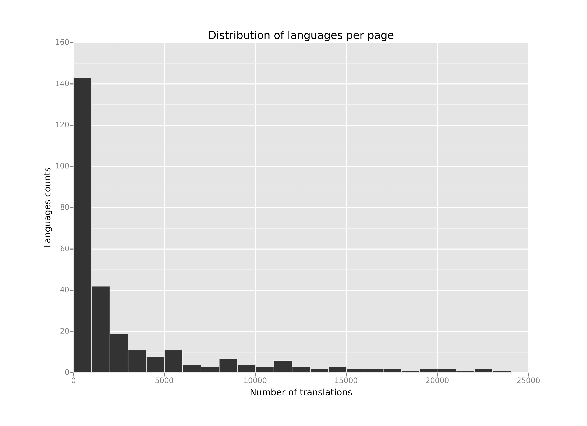

As we can see, half the languages appear at most 1000 times. Let's have a closer look at them:

    ggplot(aes(x= 'Count'), data=lang_data[lang_data['Count'] < 1000]) + 
    geom_histogram(binwidth=40) + ggtitle("Distribution of languages per page") + 
    xlab("Number of translations") + ylab("Number of languages")

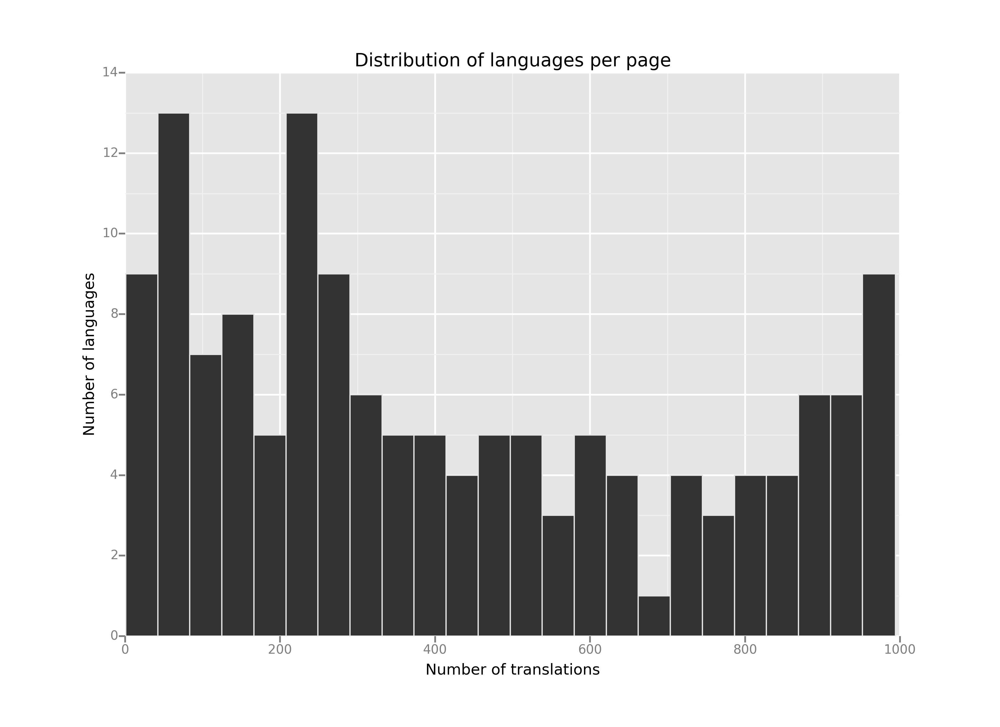

The most used languages are:

    lang_data.sort(columns='Count',ascending=False)[:10]
    fr 24038
    de 22834
    es 22185
    it 21226
    ru 20800
    pt 20186
    nl 19327
    pl 19199
    ja 18674
    sv 17854

To be honest, I expected to find simple English here, while it makes only in the top 30:
        
    sorted_lang = lang_data.sort(columns='Count',ascending=False)
    sorted_lang.index.get_loc('simple') 
    27

Maybe crawling more pages with hard topics (like math of physics) will increase its position. 

This is the distribution of the 100 less used languages 

        
    ggplot(aes(x= 'Count'), data=sorted_lang[-100:][sorted_lang[-100:]['Count'] < 600]) + 
    geom_histogram(binwidth=28) + ggtitle("Distribution of languages per page") + 
    xlab("Number of translations") + ylab("Number of languages")

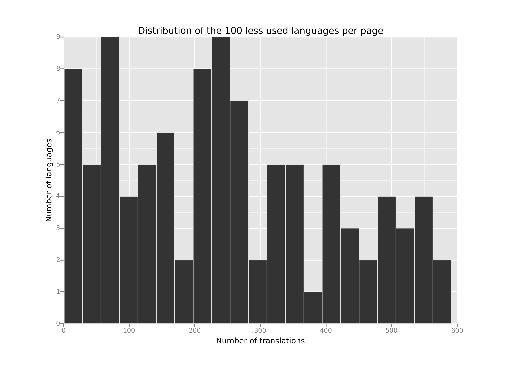

#Text

As we can see the distribution goes down pretty quickly:

    ggplot(aes(x= 'text_length'), data=DataFrame(data.text_length)) + 
    geom_histogram(binwidth=5000,fill='darkblue') +
    ggtitle("Distribution of the text length") +xlab('')

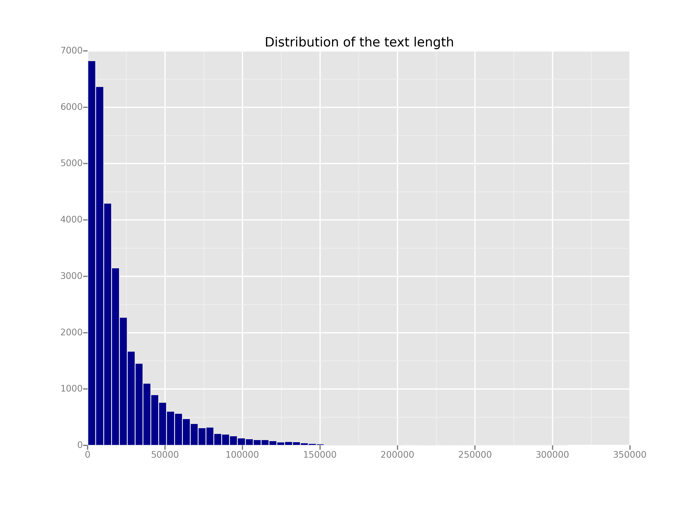

Let's zoom a couple of times in the first part of it:

    ggplot(aes(x= 'text_length'), data=DataFrame(data.text_length)[data.text_length < 150000]) + 
    geom_histogram(binwidth=2000,fill='darkblue') +
    ggtitle("Distribution of the text length") +xlab('')

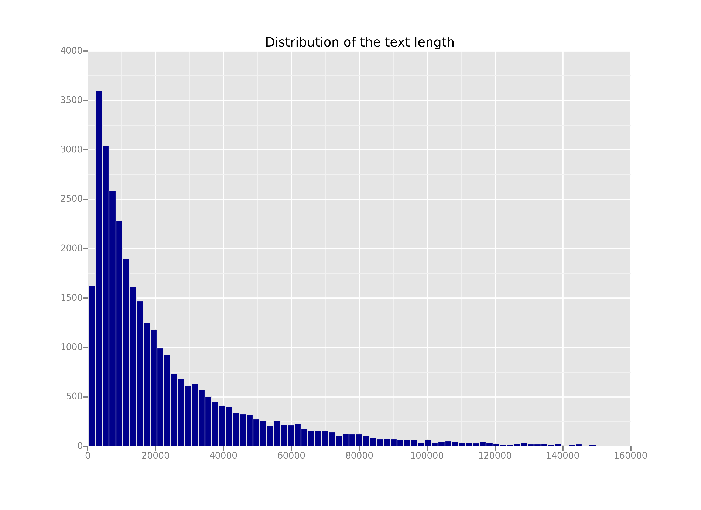

    ggplot(aes(x= 'text_length'), data=DataFrame(data.text_length)[data.text_length <= 40000]) + 
    geom_histogram(binwidth=700,fill='darkblue') +
    ggtitle("Distribution of the text length") +xlab('')

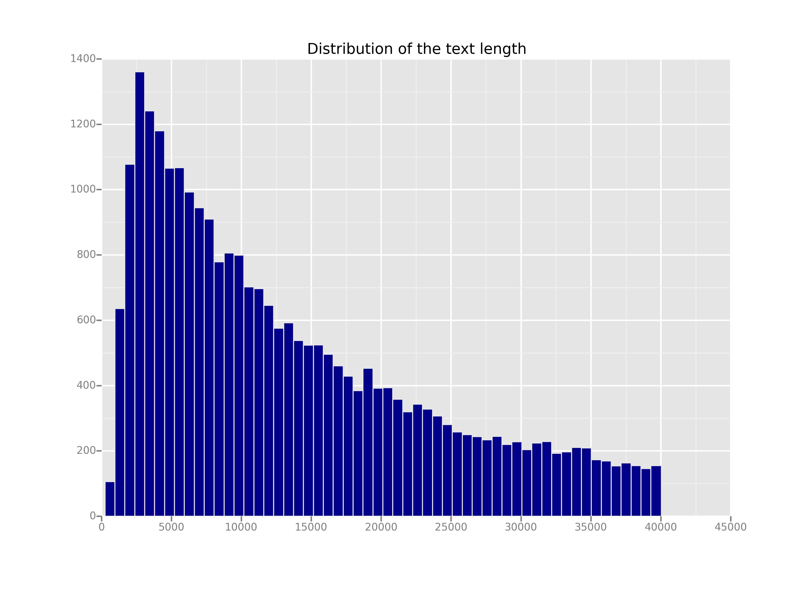

#Links
    
Which are the pages with more links in them?

    data.links_length.order(ascending=False)[:10]

    List_of_dialling_codes_in_Germany                                                   4993
    List_of_United_States_counties_and_county-equivalents                               4438
    List_of_postal_codes_in_Germany                                                     3248
    Ethanol                                                                             3141
    List_of_Roman_Catholic_dioceses_(structured_view)#Ecclesiastical_Province_of_Rome   3030
    List_of_metropolitan_areas_of_the_United_States                                     3000
    List_of_years                                                                       2931
    Alcoholic_beverage                                                                  2913
    List_of_Roman_Catholic_dioceses_(alphabetical)                                      2798
    List_of_Roman_Catholic_dioceses                                                     2798

Let's plot the distribution of the number of links in the page we have crawled:

    ggplot(aes(x= 'links_length'), data=DataFrame(data.links_length)) + geom_histogram(binwidth=30, fill='red') +\
    ggtitle("Numbers of links per page") + xlab(''

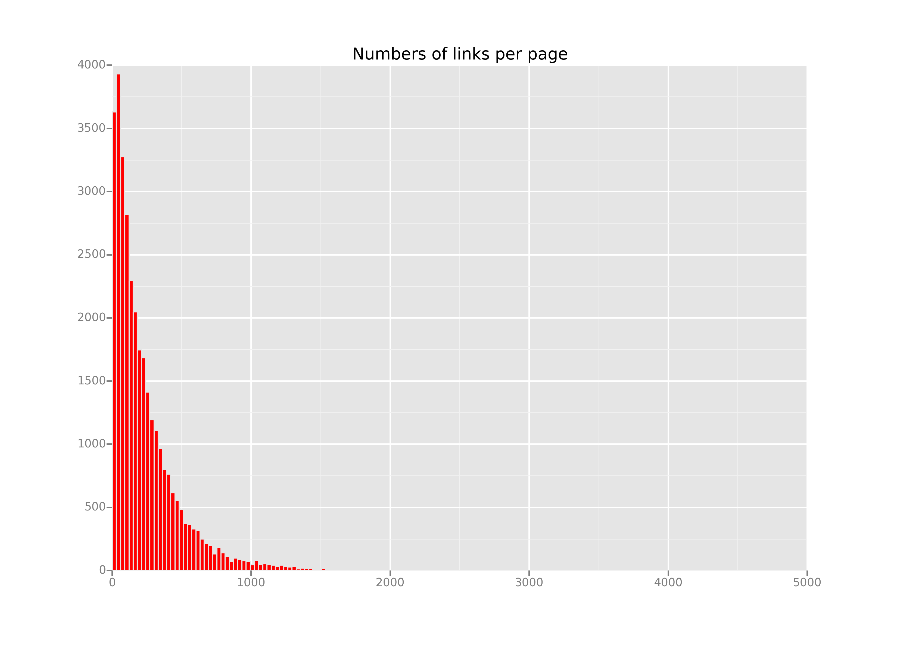
    
Let's zoom again in the where the majority of the data is:

    ggplot(aes(x= 'links_length'), data=DataFrame(data.links_length)[data.links_length < 1000]) + geom_histogram(binwidth=10, fill='red') +\
    ggtitle("Numbers of links per page") +xlab('')

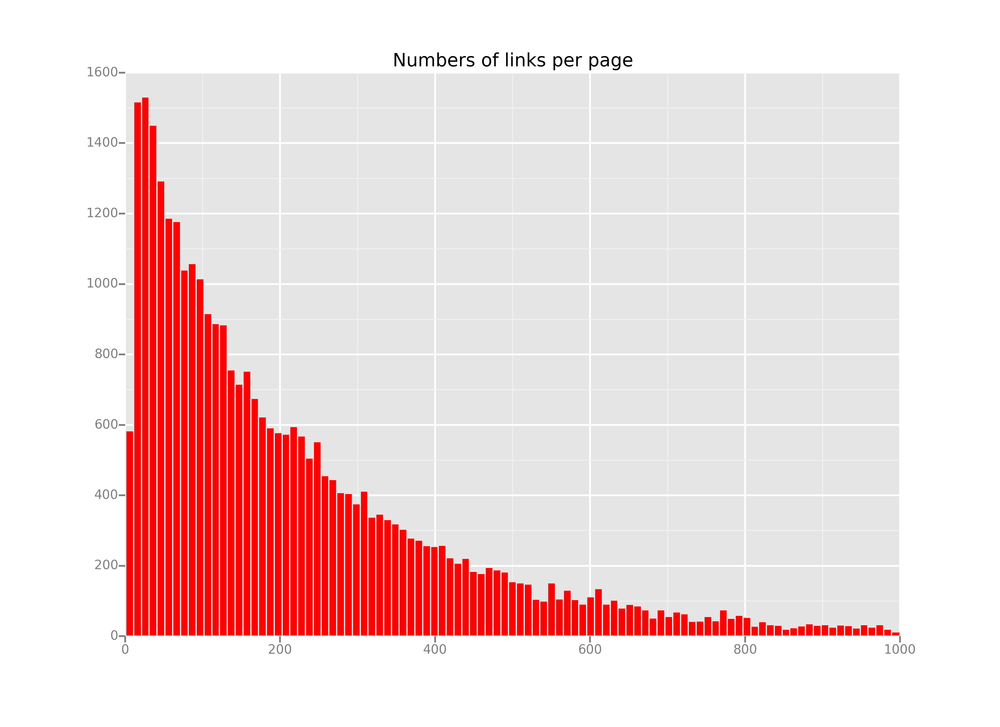

    ggplot(aes(x= 'links_length'), data=DataFrame(data.links_length)[data.links_length < 400]) + geom_histogram(binwidth=10,fill='red') +\
    ggtitle("Numbers of links per page") +xlab('')

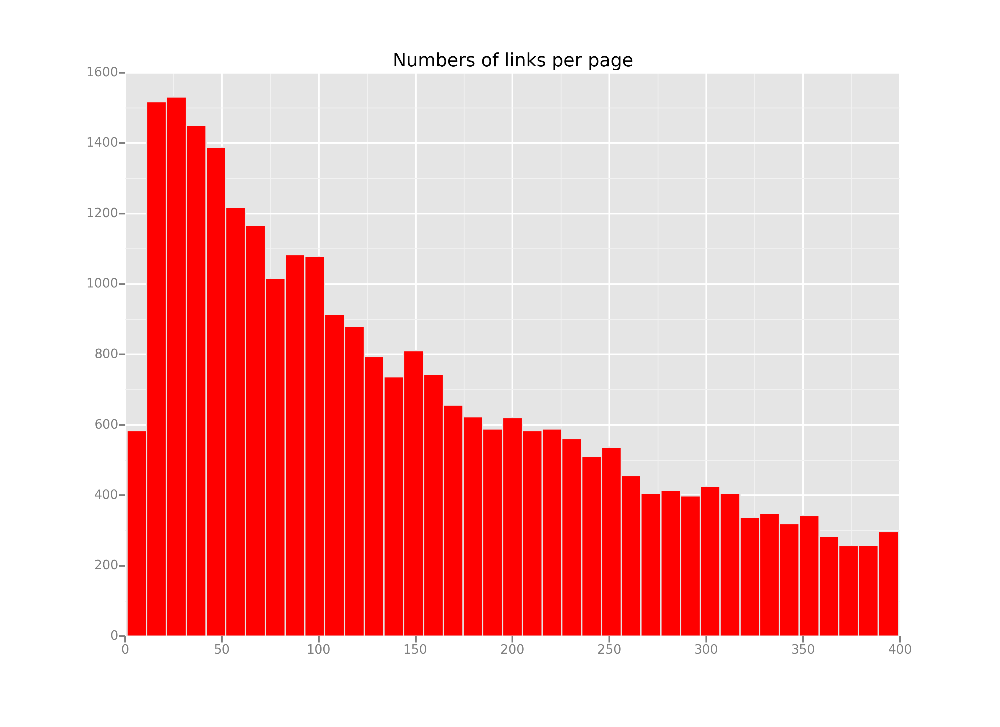

#Translations

What about the number of languages in each page (i.e. the number of translations)?
    
    ggplot(aes(x= 'languages_length'), data=DataFrame(data.languages_length)) + geom_histogram(binwidth=10, fill='yellow') +\
    ggtitle("Distribution of the number of translations") +xlab('')

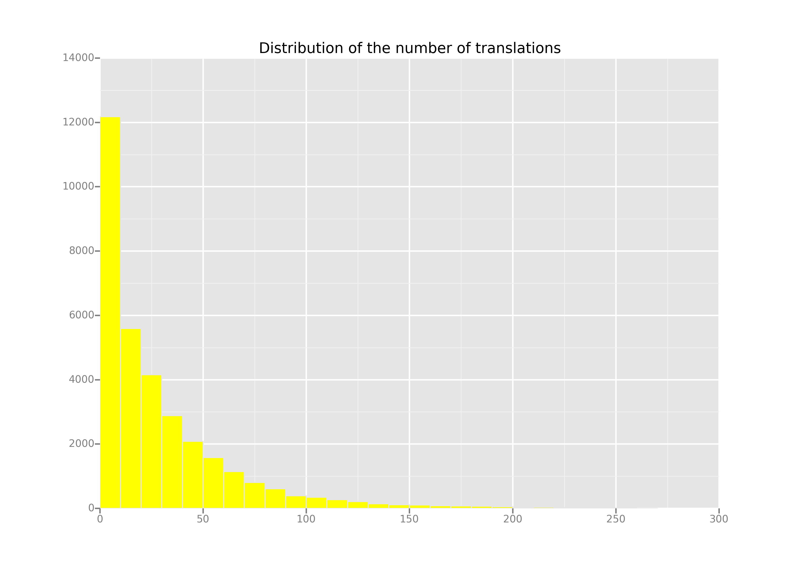

    ggplot(aes(x= 'languages_length'), data=DataFrame(data.languages_length)[data.languages_length < 100]) + geom_histogram(binwidth=2, fill='yellow') +\
    ggtitle("Distribution of the number of translations") +xlab('')

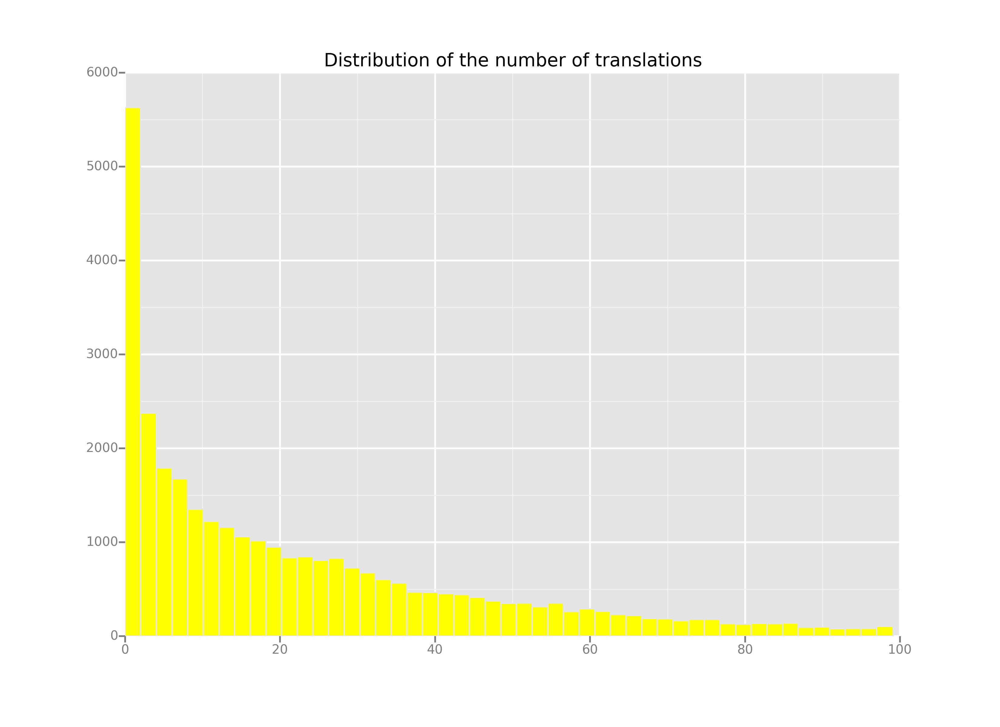

As we can see, circa 17% of the pages I crawled have at most 2 translations.

#Languages vs links
My first guess was that there is a correlation between the number of languages and the number of links in a page, so that more 'important' pages have more translation and also more links.

    
    data['languages_length'] = data.languages.apply(len)
    ggplot(aes(x='links_length', y='languages_length'), data = data) + geom_point(color='lightblue') + stat_smooth(span=.05, color='black', se=True) +
    ggtitle("Languages vs links") + xlab("Number of links") + ylab("Number of languages")

The data is very noisy, but something interesting is happening: the page with lots of links (more than 2000) usually are much less translated than the others. We don't have enough data to infer that this a general tendency or rather something caused from the specific dataset we have.

We can list such pages:

    list(data[data.links_length > 2000].sort('links_length', ascending = False).index)

    ['List_of_dialling_codes_in_Germany',
    'List_of_United_States_counties_and_county-equivalents',
    'List_of_postal_codes_in_Germany',
    'Ethanol',
    'List_of_Roman_Catholic_dioceses_(structured_view)#Ecclesiastical_Province_of_Rome',
    'List_of_metropolitan_areas_of_the_United_States',
    'List_of_years',
    'Alcoholic_beverage',
    'List_of_Roman_Catholic_dioceses',
    'List_of_Roman_Catholic_dioceses_(alphabetical)',
    '1995_in_film',
    'List_of_garden_plants',
    'List_of_towns_and_boroughs_in_Pennsylvania#Boroughs',
    '2008_in_film',
    'Winston_Churchill',
    'The_Holocaust',
    'Russia',
    'Timeline_of_United_States_history',
    '2000s_(decade)',
    'John_F._Kennedy',
    'List_of_academic_disciplines_and_sub-disciplines']

Almost all of the elements here are listing which explains the high number of links. And I guess that the general specificness of their topics is the reason why there are no translation.

Note that alcohol makes the list twice here (once as 'Ethanol' and once as 'Alcoholic_beverage').

I find some oddities here, for example 'List_of_dialling_codes_in_Germany' is not translated in German and 'List_of_Roman_Catholic_dioceses_(structured_view)' is translated only in Russian (not in Italan or Latin).

    data.ix['List_of_dialling_codes_in_Germany'].languages
    []

    data.ix['List_of_Roman_Catholic_dioceses_(structured_view)#Ecclesiastical_Province_of_Rome'].languages
    ['ru']

Also the uppermost element (which makes it the page with most links we have encountered) is Russia:

    data.sort('languages_length', ascending = False).index[0]
    'Russia'   

Let's use size of the dot and intensity of the color to show the length of the text:

    ggplot(aes(x='links_length', y='languages_length', size = 'text_length', alpha = 'text_length'), data = data) + geom_point(color='lightblue') +
    ggtitle("Languages vs links") + xlab("Number of links") + ylab("Number of languages")

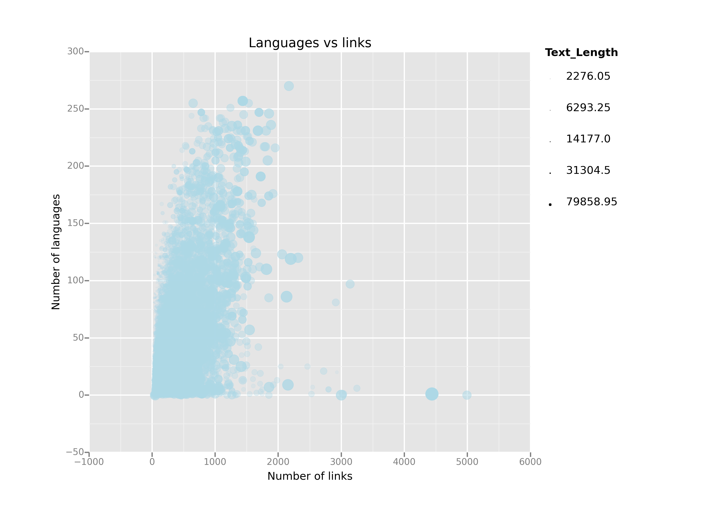
#Languages vs text length

Is there a relation between the number of languages an article is written in with the length of the text of its article?

    ggplot(aes(x='text_length', y='languages_length'), data=data) + geom_point(color='lightgreen') +
    stat_smooth(span=.05, color='black', se=True) +
    ggtitle("Languages vs text length") + xlab("Length of the text") + ylab("Number of languages")

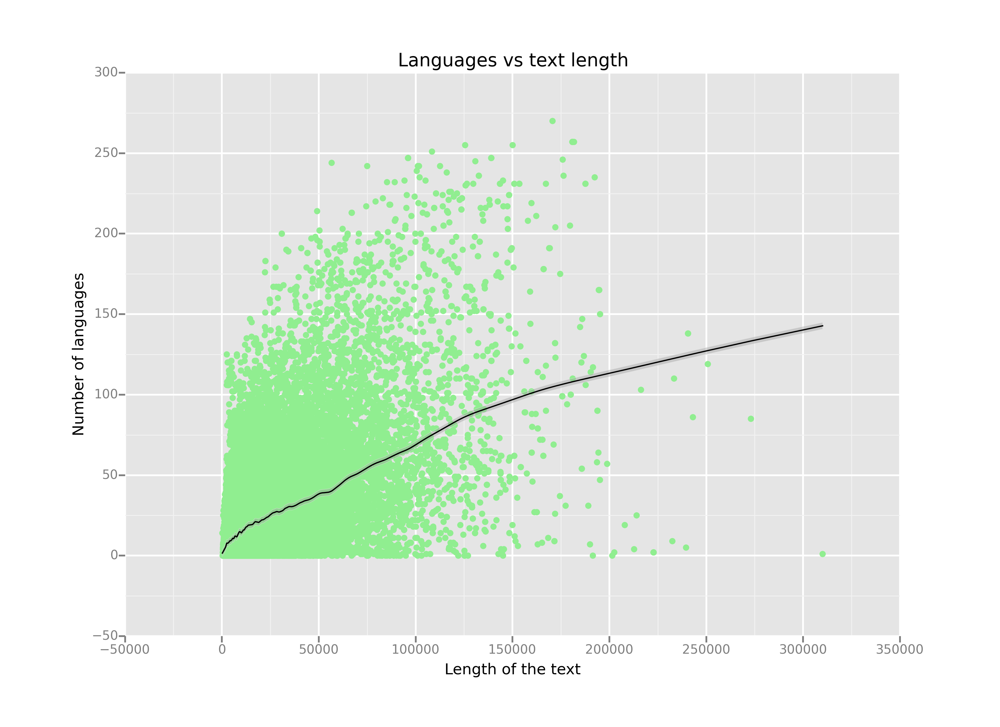

Hard to say, but there is a general tendency for articles with more pages to have more translations.

One element seems really interesting here: the page with a very long text and almost no translation:

    ['List_of_United_States_counties_and_county-equivalents']

We'll have a look later at its languages.

In general we expect the pages with long text and few translation to be very specific topics. Having a look in the dataset, we have    

    list(data[(data.text_length>200000) & (data.languages_length < 10)].index)

    ['Glossary_of_ancient_Roman_religion#capite_velato',
    'Glossary_of_ancient_Roman_religion#feria',
    'Glossary_of_ancient_Roman_religion#sacerdos',
    'Glossary_of_ancient_Roman_religion#sodalitas',
    'Imperial_Roman_army',
    'List_of_United_States_counties_and_county-equivalents',
    'List_of_metropolitan_areas_of_the_United_States',
    'Sexuality_in_ancient_Rome',
    'Telephone_numbers_in_the_United_Kingdom',
    'Timeline_of_United_States_history']

There are some other interesting pages, for which there is "not much to say" (in the sense that the text length is very small) but there are lot of translation, implying that these might be topics of general interest.

    list(data[(data.text_length<10000) & (data.languages_length > 100)].index)

    ['117',
    '138',
    '14',
    '1492',
    '161',
    '169',
    '180',
    '192',
    '2nd_century',
    '37',
    '41',
    '45_AD',
    '476',
    '4th_century',
    '54',
    '5th_century',
    '68',
    '69',
    '75',
    '76',
    '762',
    '77',
    '78',
    '79',
    '80',
    '81',
    '82',
    '83',
    '84',
    '93',
    '94',
    '95',
    '96',
    '97',
    '98',
    '99',
    'Archipelago',
    'B',
    'Centuries',
    'Century',
    'Country',
    'D',
    'East',
    'I',
    'Neck',
    'Night',
    'North',
    'Population_density',
    'Song',
    'South',
    'Square_(geometry)',
    'West']

As before, let's include the size of the dots:

    ggplot(aes(x='text_length', y='languages_length', size = 'links_length', alpha = 'links_length'), data = data) + geom_point(color='lightgreen') +
    ggtitle("Languages vs links") + xlab("Length of the text") + ylab("Number of languages")

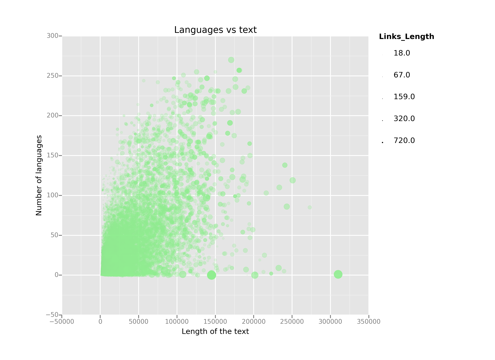

#Text length vs number of links

There seems to be a cleaner relation  between the text length and the number of links present on a page.
This is in part obvious because, by definition, links contains words.

    ggplot(aes(x='links_length', y='text_length'), data = data) + geom_point(color='orange') + 
    stat_smooth(span=.05, color='black', se=True) + ggtitle("Text length vs number of links") + 
    xlab("Number of links") +ylab("Text length")

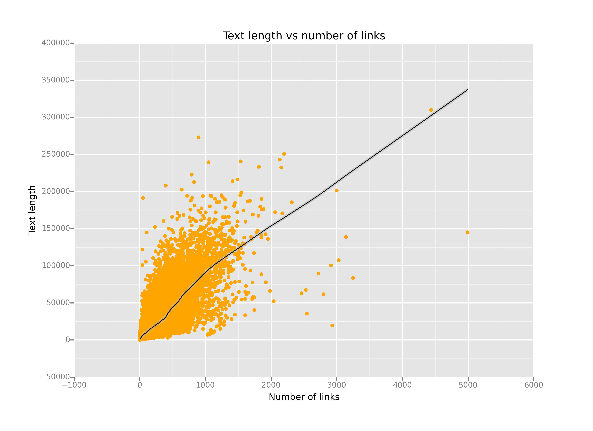

Which pages contains many links compared to they text length?

    list(data[(data['links_length']>2000) & (data['text_length'] < 150000)].index)

    ['1995_in_film',
     '2008_in_film',
     'Alcoholic_beverage',
     'Ethanol',
     'List_of_Roman_Catholic_dioceses',
     'List_of_Roman_Catholic_dioceses_(alphabetical)',
     'List_of_Roman_Catholic_dioceses_(structured_view)#Ecclesiastical_Province_of_Rome',
     'List_of_academic_disciplines_and_sub-disciplines',
     'List_of_dialling_codes_in_Germany',
     'List_of_garden_plants',
     'List_of_postal_codes_in_Germany',
     'List_of_towns_and_boroughs_in_Pennsylvania#Boroughs',
     'List_of_years']

Note that the pages in the previous list have a very small abstract. On the other hand, the points lying on the linear model, i.e.

     list(data[(data['links_length']>2800) & (data['text_length'] > 180000)].index)

     ['List_of_United_States_counties_and_county-equivalents',
      'List_of_metropolitan_areas_of_the_United_States']

have a bigger abstract before start listing elements.
Note that the first page here is translated in Finnish (why people in Finland are interested in the list of countries in the US?).

Let's see some page that have more word than links with respect to the above module. 
We would expect this pages to be more descriptive, illustrative and detailed. 
As we can see from the following list, I should have cleaned the data before this analysis, so that 'Glossary_of_ancient_Roman_religion' would appear only once, and the two capitalization for 'Roman_Empire' would coincide.  
Anyways, in this "chatty" pages, the Ancient Romans appear 3 times out of 10 unique elements. I think this is a bias due to my personal choices in the starting point of the crawl.  

    list(data[(data['links_length']<2000) & (data['text_length'] > 200000)].index)

    ['Glossary_of_ancient_Roman_religion#capite_velato',
    'Glossary_of_ancient_Roman_religion#feria',
    'Glossary_of_ancient_Roman_religion#sacerdos',
    'Glossary_of_ancient_Roman_religion#sodalitas',
    'Golden_eagle',
    'Greek_government-debt_crisis',
    'Imperial_Roman_army',
    'Libertarian_socialism',
    'Roman_Empire',
    'Roman_empire',
    'Sexuality_in_ancient_Rome',
    'Socialism',
    'Telephone_numbers_in_the_United_Kingdom',
    'Vietnam_War']

This is how our data look like when we include the size in the picture:

    ggplot(aes(x='links_length', y='text_length', size = 'languages_length', alpha = 'languages_length'), data = data) + 
    geom_point(color='orange') + ggtitle("Text length vs number of links") + 
    xlab("Number of links") +ylab("Text length") 

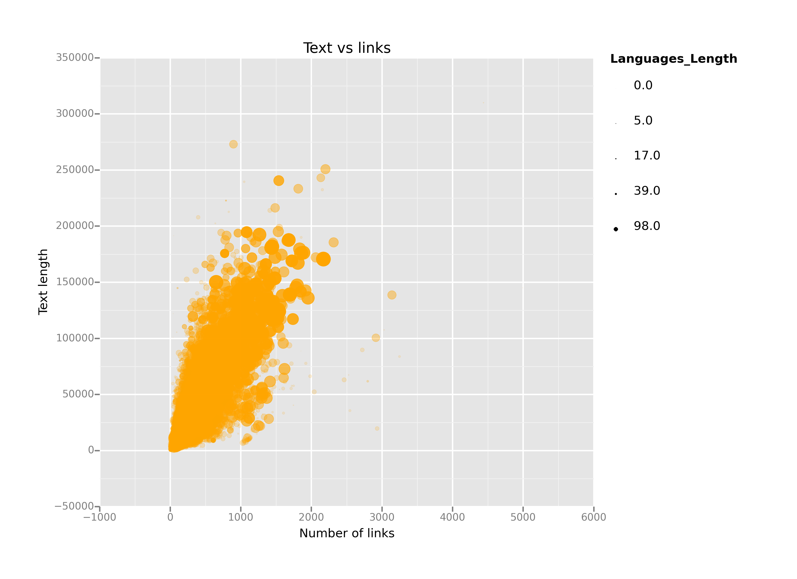
