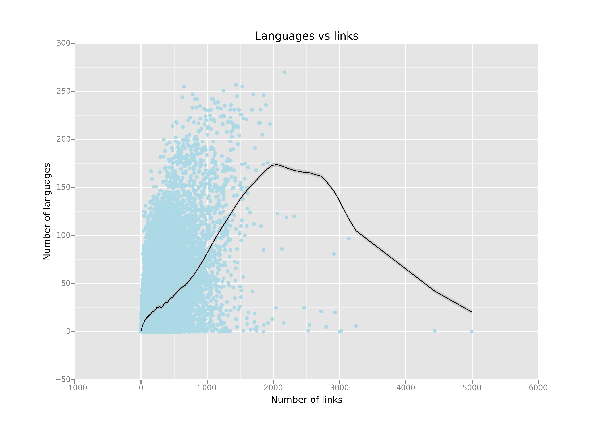

#Exploration into the English Wikipedia World

After gathering some data with my WikiCrawler I decided to have a look at them.

##Structure of the data

The data are structured as a dictionary of dictionary. 
The keys of the outermost one are the page visited, while its values are the dictionary

    {
        'links': links,
        'text_length' : text_length, 
        'languages' : languages, 'time_stamp': time_stamp
    }

First of all, let's count how many pages have been crawled:

    len(data)
    33022

As of 16 June 2014 the [number of Wikipedia articles](http://en.wikipedia.org/wiki/Wikipedia:Size_of_Wikipedia) is 4,536,157.
This means that my data correspond roughly to 0.0073% of the complete corpus. Thus the following analysis doesn't intend to be complete or exhaustive in any way.    

#Language analysis

Some pages do have translation to other languages. How many languages, have I reached in the crawling? 

    lang_data = DataFrame(dict(data.languages.map(collections.Counter).sum()),
        index=['Count']).transpose()
    len(lang_data)
    284

It is interesting to see how this 284 languages are distributed among our pages. Using ggplot we obtain the following histogram:

    ggplot(aes(x= 'Count'), data=lang_data) + geom_histogram(binwidth=1000) +
    ggtitle("Distribution of languages per page") + xlab("Number of translations") + ylab("Languages counts")

As we can see, half the languages appear at most 1000 times. Let's have a closer look at them:

    ggplot(aes(x= 'Count'), data=lang_data[lang_data['Count'] < 1000]) + 
    geom_histogram(binwidth=40) + ggtitle("Distribution of languages per page") + 
    xlab("Number of translations") + ylab("Number of languages")

The most used languages are:

    lang_data.sort(columns='Count',ascending=False)[:10]
    fr 24038
    de 22834
    es 22185
    it 21226
    ru 20800
    pt 20186
    nl 19327
    pl 19199
    ja 18674
    sv 17854

I expected to find simple English here, while it makes only in the top 30:
        
    sorted_lang = lang_data.sort(columns='Count',ascending=False)
    sorted_lang.index.get_loc('simple') 
    27

Maybe crawling more pages with hard (like math of physics) topics will increase its position. 

This is the distribution of the 100 less used languages 

        
    ggplot(aes(x= 'Count'), data=sorted_lang[-100:][sorted_lang[-100:]['Count'] < 600]) + 
    geom_histogram(binwidth=28) + ggtitle("Distribution of languages per page") + 
    xlab("Number of translations") + ylab("Number of languages")

###Languages vs links
My first guess was that there is a correlation between the number of languages and the number of links in a page, so that more 'important' pages have more translation and also more links.

    
    ggplot(aes(x='links_len', y='languages_len'), data = data) + geom_point(color='lightblue') + stat_smooth(span=.05, color='black', se=True) +\
    ggtitle("Languages vs links") + xlab("Number of links") + ylab("Number of languages")

The data is very noisy, but something interesting is happening: the page with lots of links (more than 2000) usually are much less translated than the others.
Let's have a look at them

    list(data[data.links_len > 2000].sort('links_len', ascending = False).index)

    ['List_of_dialling_codes_in_Germany',
    'List_of_United_States_counties_and_county-equivalents',
    'List_of_postal_codes_in_Germany',
    'Ethanol',
    'List_of_Roman_Catholic_dioceses_(structured_view)#Ecclesiastical_Province_of_Rome',
    'List_of_metropolitan_areas_of_the_United_States',
    'List_of_years',
    'Alcoholic_beverage',
    'List_of_Roman_Catholic_dioceses',
    'List_of_Roman_Catholic_dioceses_(alphabetical)',
    '1995_in_film',
    'List_of_garden_plants',
    'List_of_towns_and_boroughs_in_Pennsylvania#Boroughs',
    '2008_in_film',
    'Winston_Churchill',
    'The_Holocaust',
    'Russia',
    'Timeline_of_United_States_history',
    '2000s_(decade)',
    'John_F._Kennedy',
    'List_of_academic_disciplines_and_sub-disciplines']

Almost all of the elements here are listing which explains the high number of links. And I guess that the general specificness of their topics is the reason why there are no translation.

Note that alcohol makes the list twice here (once as 'Ethanol' and once as 'Alcoholic_beverage').

I find some oddities here, for example `'List_of_dialling_codes_in_Germany'` is not translated in German and `'List_of_Roman_Catholic_dioceses_(structured_view)'` is translated only in Russian (not in Italan or Latin).

    data.ix['List_of_dialling_codes_in_Germany'].languages
    []

    data.ix['List_of_Roman_Catholic_dioceses_(structured_view)#Ecclesiastical_Province_of_Rome'].languages
    ['ru']

Also the upper most dot (which makes it the page with most links I have encountered) is Russia:

    data.sort('languages_len', ascending = False).index[0]
    'Russia'    
