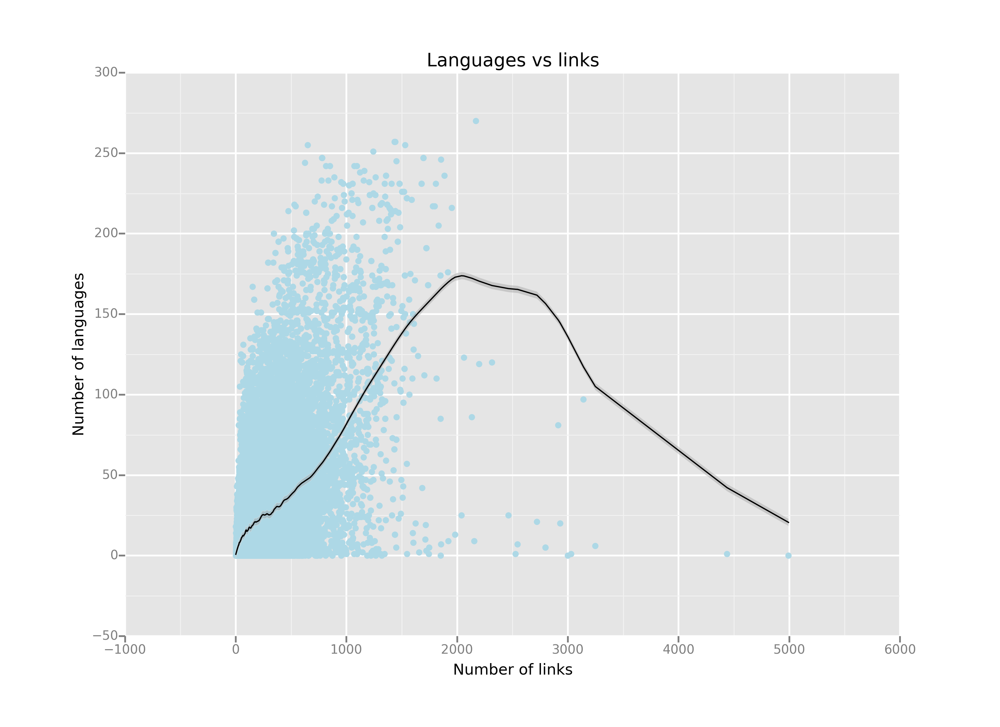
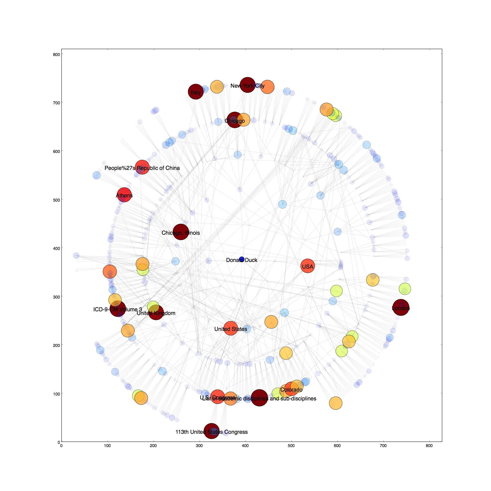

#WikiCrawer:

This is a basic crawler for Wikipedia articles.
Please don't use it to aggressively crawl Wiki and remember to follow [their rules](
http://en.wikipedia.org/wiki/Wikipedia:Database_download#Please_do_not_use_a_web_crawler).

Only articles pages are saved. Disambiguations, links to files or other external links are discarded.

Pages are visited only once, so their data may not be up to date. More recent pages have a time stamp created at the moment of crawling.

Links are saved in the order they appear on the page.

I have implemented some breath first search algorithms to visit the links. All of them allow cycles in the graph. It is possible to limit the search to the first _n_ links and to depth _d_.

## Project overview:

### [Analytics](Analytics.md)

where I show relationship among number of links, number of translations and text length.

 The work was done with [this](Analytics.ipynb) iPython notebook; I used the `ggplot` package for the visualization.

### [Graph functions](GraphHelper.py)

where function relative to graph are collected. A part from the classical ones like DFS, BFS (used to find the shortest path), there are implementations for topological sort and strongly connected components. Everything was recoded from scratch, using Python top-level functions.
Among these, the function `reduce_graph` was pretty important, especially having plots in mind. The average page has too many links to be visualized: this function will consider only the first _n_ links of a given page.

### [Wikipedia graph](graphs)

This folder contains all the graphs I generated using this [notebook](Plot Graph (Python 2).ipynb). Note that the [main crawler](WikiCrawler.py) was written in Python 3 and `pygraphviz` was working correctly only in Python 2. So [this](Convert graph (Python 3).ipynb) exported the data into `JSON`.

Let's consider the following example:

the node at the center represent the Wikipedia page relative to Donald Duck, with each circle being an extra link level. So for example the elements in the second circle are the pages that are reachable from Donald Duck in two steps. In this particular case, each page contains at most 5 links.

Node color and node size are proportional to the number of links contained in the page.

 In the [graphs](graphs) folder there are more experiment with different starting nodes, number of links per page and number of layers.
No

##Possible improvements::

* find interesting or amusing connections between totally unrelated topics. For example the trip from Machiavelli to French fries (and back) is:

        ['Niccolò_Machiavelli', 'Florence', 'Brussels', 'French_fries']

        ['French_fries', 'Belgium', 'Head_of_state', 'Niccolò_Machiavelli']

    Note that both paths go through Belgium or Brussels

* draw the word cloud for the start page and see how it changes when visiting new pages in the path

* use a NoSQL database (mongodb?) to store the data. Change the save method to save only the pages crawled since the last save. Load method needs to load only the list of visited pages.
I have a dataset large enough now, so I don't see this a priority for now. Especially since it is possible to download the whole Wikipedia dump in one go.

